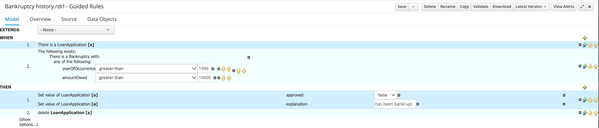
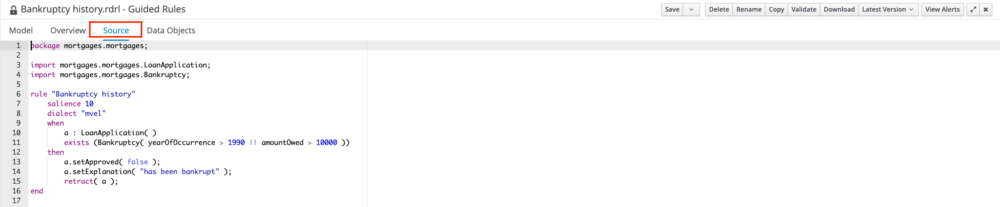
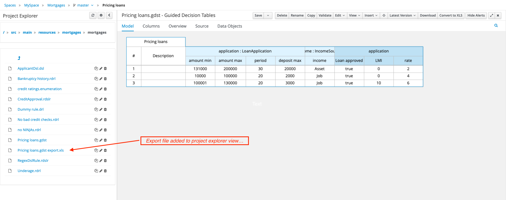

include::../partials/attributes.adoc[]
= Migrating from Business Central to IBM {DEV_TOOLS}

== Overview

Business Central is the previous generation web-based platform for authoring business automation assets such as data objects, rules, processes, cases, and planning entities.
It included capabilities for monitoring, administration, and management of business automation assets.
With the release of both IBM {DEV_TOOLS} and IBM {CANVAS}, most of the asset management capabilities were replaced or sometimes take a different approach altogether.
This section describes the migration of business assets that are created in Business Central so that developers can maintain them by using {DEV_TOOLS} or {CANVAS} or both.

== Prerequisites

The following tools are required to migrate from Business Central to {DEV_TOOLS}.
It is assumed that you have a current version of Business Central running to export certain types of assets to their supported form in {PRODUCT_SHORT}:

include::../partials/prerequisites.adoc[]

== Business Automation Assets in Businss Central

The following table focuses on business automation assets no longer supported in the new tools but available in Business Central.
The table indicates how to manage assets in the absence of Business Central.

.Business Central Asset Types
[cols="2,1,4,3,3"]
|===
| `Asset Name` | `Asset Type`| `Description`| `Supported Tools in Version {VERSION}`  | `Additional Information`

| Business Process | Process (.bpmn) | Modeled as Business Process Model & Notation (BPMN) diagrams | {DEV_TOOLS} +
{CANVAS} | Also used for straight-through-processing (STP) and rule orchestration flow
| Decision Model | Decision (.dmn) | Modeled as Decision Modeling & Notation (DMN) diagrams | {DEV_TOOLS} +
{CANVAS} |
| Technical Rule | Decision (.drl) | Drools Rule Language, used for technical rules | {DEV_TOOLS} |
| Decision Table (Spreadsheet) | Decision (.xls) | DRL-based decision table, modeled as an Excel spreadsheet | {DEV_TOOLS} +
MS Excel Online |
| Test Scenario | Decision (.scesim) | Test scenario used for decision unit testing. _Currently only DMN testing is available. DRL testing will be available too in future._ | {DEV_TOOLS} |
| Data Object | Model (.java) | Java data object used by rules and processes | {DEV_TOOLS} | Define as separate Maven dependency project
| Global Variable(s) | Decision (.drl) | Vocabulary definition | {DEV_TOOLS} | Managed directly in .drl files
| Domain Specific Language Definition | Decision (.dsl) | Vocabulary definition | **Deprecated** |
| Enumeration | Model | Vocabulary definition | {DEV_TOOLS} | Managed directly in .drl files
| Form | Forms (.frm) | Human Form | **Deprecated** | New form builder in future release
| Guided Decision Table | Decision (.gdst) | Guided Decisison Table | **Deprecated** | **Export** from BC to Decision Table Spreadsheet (XLS)
| Guided Decision Table Graph | Decision (.gdst-set) | Guided Decision Table Graph| **Deprecated** | 
| Guided Rule | Decision (.rdrl) | Guided Technical Rule | {DEV_TOOLS} | **Copy** source from BC to new Technical Rule (.drl) file
| Guided Rule Template | Decision (.template) | Template for guided rules | | {DEV_TOOLS} | **Copy** source from BC to new Technical Rule (.drl) file
| Test Scenario (Legacy)| Decision (.scenario) | Legacy (guided) test scenario used for rule unit testing | **Deprecated** |

|===

[NOTE]
====
Test scenarios are not supported in {CANVAS} for now as it contains its own test scenario assets. There can be compatibility between the test scenarios.
====

== Migration of Deprecated Assets

While all the guided editors are deprecated in {PRODUCT} v{VERSION}, your efforts are not lost by building those assets.
Even though all guided editors have been deprecated in {PRODUCT} v{VERSION} you will not loose all your effort into building those 
assets.  It is possible to convert certain guided assets to their non-guided and supported form.  The following table indicates the mapping 
from guided to non-guided form:

.Business Central Guided Asset Types
[cols="2,3,3"]
|===
| `Asset Name & Type` | `Description` | `Non-guided Form of Version 9.0`
| Guided Decision Table (.gdst) | Guided Decisison Table | **Export** from BC to Decision Table Spreadsheet (.xls)
| Guided Rule (.rdrl) | Technical Rule (.drl) | **Copy** source from BC to new Technical Rule (.drl) file
| Rule Template (.template) | Technical Rule (.drl) | **Copy** source from BC to new Technical Rule (.drl) file
|===

== **Copying** the asset Source from Business Central

All the guided assets are Drools Rule Language (.drl) files. A guided asset can be refactored into a non-guided asset by copying the source from the source tab in Business Central 
into a file with the file extension, . drl. Follow the examples to accomplish it.

**Examples**

.Guided Rule in Business Central

As you can see from the figure 1, this is the default tab (Model) in Business Central’s guided rule editor. If you navigate to the Source tab, you can see that the guided rule is actually Drools Rule Language (DRL), like the following example:

.Guided Rule in Business Central (Source Tab)

Follow the steps to make this rule into non-guided form so that it can be modified by {DEV_TOOLS}:

. Copy the contents of the rule in the Source tab
. Create a new text file, using proper naming conventions, and paste the contents from the Source tab into the new file
. Specify file an extension as `.drl`
. Add the file to the `src/main/resources` folder in your Maven project.

[NOTE]
====    
Some guided rules when authored with the guided rule editor, create additional rule attributes which might or might not continue to be relevant to your rule execution pattern. For example, salience, dialect, no-loop, & lock-on-active. While these attributes play an unique role in the guided rules, it might impact the overall behavior of your rule set.
====

You can modify the new technical rule as per your needs such as, updating to use rule units, using OOPATH syntax vs mvel, etc.

== **Exporting** the asset from Business Central

Guided Decision Tables are a wizard-based alternative to the uploaded decision table spreadsheets for defining business rules in a tabular format.

By using the guided decision tables, you are assisted by a UI-based wizard in Business Central to define the rule attributes, metadata, conditions, and actions depending on the specified data objects in your project.

After creating the guided decision tables, the rules you defined are compiled into Drools Rule Language (DRL) rules like all other rule assets.

As the Guided Decision Table editor that is in Business Central is deprecated, users need to export guided decision tables to Excel format. To achieve this using the Guided Decision table, follow the examples.

**Examples**

.Guided Decision Table in Business Central
image::../images/bc-example-guided-dt.png[Guided Decision Table in Business Central]

Follow the steps to make the decision table into non-guided form so that it can be modified by {DEV_TOOLS}:

. Convert to XLS using the Business Central option from the button bar
. Select the newly created .xls file in the Project Explorer
. Select one of the Download options from the button bar
. Add this file to the `src/main/resources` folder of your Maven project.

As you can see from figure 1, this is the default tab (Model) in Business Central’s
Guided decision table editor. If you navigate to the Source tab, you can see that the guided decision table is an editor view on the standard technical rule written using Drools Rule Language (DLR), as in the following example.

.Guided Decision Table in Business Central (Source Tab)
image::../images/bc-example-guide-dt-source.png[Guided Decision Table in Business Central]

You now have a choice either to take the same approach like the guided rules or export the table to Excel format by clicking (Convert to XLS), as in the following example.

.Exporting a Guided Decision Table in Business Central
image::../images/bc-example-guided-dt-export.png[Exporting a Guided Decision Table in Business Central]

Once the table has been converted to XLS format, the new file is added to the Business Central `Project Explorer` view:

.Converted Guided Decision Table in Business Central

From there it is simply a matter of selecting the converted file and pressing one of the `Download` buttons in Business Central, which will download the converted spreadsheet file to your local machine so the file can be added to your project's `src/main/resources` folder of your Maven project.

.Converted Guided Decision Table in Business Central
image::../images/bc-example-guided-dt-export-download.png[Exporting a Guided Decision Table in Business Central]

[NOTE]
====
Guided Decision Tables are a collection of technical rules generated by using .drl syntax.
The number of rows in a decision table is equal to the number of individual technical rules generated, one for each row.
The rules make use of salience to orchestrate the execution of each row of the decision table.
It is possible to replace a decision table directly with the technical rules compared to exporting to excel format by following the pattern to generate the rules.
====
