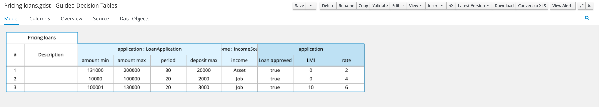
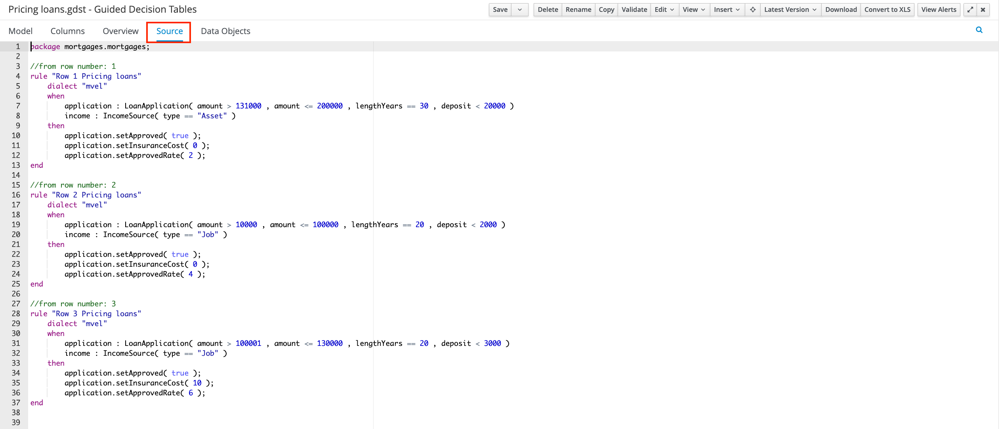
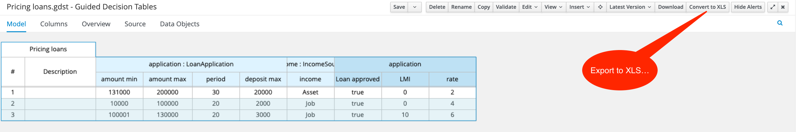
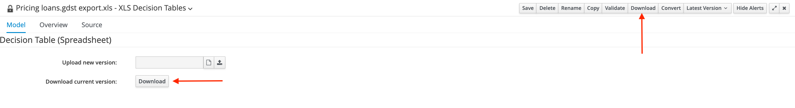

= Upgrading

include::../partials/attributes.adoc[]

You can upgrade your existing business automation applications and platforms to the most recent version of {PRODUCT_LONG}. The supported upgrade process is from the previous version to the current version. If you are upgrading from an older version, you must follow the steps to upgrade to each intermediate version, as documented. Depending on the complexity of your installation, you might want IBM(R) Services to participate in your project. If so, contact your IBM service representative.
If you want to know more on how the upgrading was done to version {VERSION_80}, see https://ibmdocs-test.dcs.ibm.com/docs/en/ibamoe/8.0.x?topic=upgrading[Upgrading]

== Overview

This section describes upgradation of existing applications from version {VERSION_80} to version {VERSION_90X} of {PRODUCT_LONG}. In version {VERSION_90X}, the approach to deployment and runtime works in a very different way compared to version {VERSION_80}. It uses a cloud native, serverless, micro-service architecture to deploy business automation projects that include a runtime via Maven plug-ins, directly to your cloud platform. Whereas in version {VERSION_80}, you packaged your BAMOE projects as KJars to be deployed on Kie Server. Hence, tools like Smart router which was designed to aggregate multiple independent KIE Server instances as though they were a single server are no longer necessary in the {PRODUCT_SHORT} version {VERSION_90X} architecture.

Following table specifies the key differences between each version.

.Technology stack
|===
| Product features | version {VERSION_80} | version {VERSION_90X}

| Java stack   
| Traditional Java EE (Mainly APP servers)
| Modern runtimes (Quarkus 2*)

| Architecture
| Monolithic
| Microservices

| Engine API
| Extensive out-of-the-box set
| Automatically generated

| Cloud approach
| Cloud-ready
| Cloud-first

| Event driven architecture
| BPMN,DMN, medium-effort setup
| BPMN, DMN, low-effort setup

| Web modeling tool
| Monolith; Higher resource consumption; lower performance
| Decoupled; Extremely scalable, ready-to-use

| Business APP development
| Requires build (kjar) & deployment on the engine (KIE Server)
| Same build & deployment process of a Java Microservice

| Build your own containers
| Partially (Supported engine images with Red Hat EAP only)
| Yes

| 100% open source
| Yes
| Yes

| Hot-reload during development
| No
| Yes for BPMN & DMN

| Container orchestrators 
| OpenShift only
| OpenShift + Selected (CNCF) Kubernetes distributions

|===

== Prerequisites

The following tools are required to be upgraded to {PRODUCT_SHORT} version {VERSION_90X}:

- JDK 11 or later is installed.

- Apache Maven 3.8.6 or later is installed.

- Visual Studio Code IDE latest version

- IBM BAMOE Developer Tools latest version of VS Code IDE extensions

// include::../partials/prerequisites.adoc[]

=== Procedure

While it is possible to upgrade an existing **Knowledge Jar (KJAR)** project, it is recommended that you start your project from scratch, since the Maven configuration for {PRODUCT_SHORT} version {VERSION_901} is significantly different from that of {PRODUCT_SHORT} version {VERSION_80} or {RH_DM} Version 7.
Note that the process is simple, as it is driven by Maven, and Quarkus specifically.  

The first step is to generate a new Maven project so that there is a place to upgrade your existing business automation assets into the new {PRODUCT_SHORT} architecture.
There are several ways to create Maven projects, however the approach is to use a published Maven plugin.
Follow the procedure to ensure that the Maven project is setup properly.

== Step 1: Download Product Archives

The first step in upgrading is to download the product archives from either {PRODUCT_FIX_CENTRAL_PAGE}[IBM Fix Central] _(which requires an active support subscription to {PRODUCT})_ or via the {DEV_PROGRAM_PAGE}[IBM Business Automation Manager Open Editions Developer Program] _(subject to its terms)_.
Download the files _(replace with the most current version)_ based on your requirement.
The following table shows the most common files but you can select other files according to your environment.

.{PRODUCT_SHORT} Product Archives

The following archives are typically used in upgrading to {PRODUCT_SHORT}:

.Common Product Archives
|===
| Product Archive | Description

| bamoe-{VERSION}-extended-services-image.tar.gz   
| This image provides features like DMN Runner, static validation of DMN, BPMN models, and also provides a proxy to communicate with OpenShift and Kubernetes clusters.

| bamoe-9.0.0-git-cors-proxy-image.tar.gz 
| This image provides a proxy to allow BAMOE Canvas web app to communicate with Git providers, like github.com and bitbucket.org.

| bamoe-9.0.0-canvas-image.tar.gz   
| BAMOE Canvas is a web application that provides authoring tools for Decisions and Workflows, directly in the browser.

| bamoe-9.0.0-containers-sources.zip   
| No additional information.

| bamoe-9.0.0-canvas-compose.zip   
| This package contains the `docker-compose` file to run Business Automation Manager Open Edition 9.0.0 Canvas and all related services.

| bamoe-9.0.0-kogito-examples.zip   
| The Business Automation Manager Open Editions (BAMOE) Kogito Examples include example applications which contain various types of services on Red Hat build of Quarkus to help you develop your own applications. The services use one or more Decision Model and Notation (DMN) decision models, Drools Rule Language (DRL) rule units, Predictive Model Markup Language (PMML) models, or Java classes to define the service logic.

For information about each example application and instructions for using them, see the README file in the relevant application folder.

| bamoe-9.0.0-licenses.zip   
| No additional information.

| bamoe-9.0.0-maven-repository.zip   
| The maven repository contains many of the artifacts that Java developers typically use to build their applications.

| bamoe-9.0.0-sources.zip 
| No additional information. 

|===

Now that you have the files, you can start the upgrading process.

== Step 2: Update Maven Configuration and settings

https://maven.apache.org/[Apache Maven] is a software project management and comprehension tool. Based on the concept of a project object model (POM), Maven can manage a project's build, reporting and documentation from a central piece of information.
{PRODUCT_LONG} relies on Maven in order to build various types of deployable artifacts, such as decision service applications. For a quick start, see the https://maven.apache.org/guides/getting-started/[Maven Quick Start Guide].

Since {PRODUCT_SHORT} version {VERSION_901} is based on Quarkus 2, the easiest route is to use the Quarkus Maven Plugin and adjust some of the details in the generated project to align it with {PRODUCT_SHORT} dependencies and plugins.
You can read all about **Quarkus and Maven** https://quarkus.io/guides/maven-tooling[here].

The `settings.xml` file is a repository for customizing Maven’s global operational parameters, distinguishing itself from `pom.xml` by its non-association with particular projects.
This file includes configurations such as the location of the local repository, alternative sources for remote repositories, and inputting credentials, among others.

There are two directories for the storage of the settings.xml file:

- Maven Installation Directory: Found at ${Maven.home}/conf/settings.xml, this location reflects the settings applied universally across all Maven projects on the system.
- User-Specific Configuration: Located at ${user.home}/.m2/settings.xml, this directory allows for the storage of user-specific Maven settings.

Users can adjust their Maven environment to better suit their development needs by using these configurations.

[NOTE]
====
The first `settings.xml` is also referred to as `global settings`, and the second is referenced as user settings.
Both are combined with users taking precedence.
====

If you need to create user-specific settings from scratch, it is easiest to copy the global settings from your Maven installation to your *_${user.home}/.m2_* directory.
Maven's default *_settings.xml_* is a template with comments and examples so you can quickly tweak it to match your needs.
_If you are looking to learn more about how to manage your various Maven settings, see https://maven.apache.org/settings.html[Maven Settings Reference]._

With the knowledge from {PRODUCT} Version 8 or Red Hat's Version 7, you might be familiar with product dependencies hosted by https://maven.repository.redhat.com/ga/com/redhat/ba/[Red Hat's Maven repository].
However, this is not required anymore as the product dependencies are hosted by https://central.sonatype.com/search?q=bamoe[Maven Central].
There is no need to include an additional repository in `pom.xml` or `settings.xml`.

== Step 3: Update tooling

Automated update tools are often provided with both patch updates and new minor versions of {PRODUCT} to facilitate updating certain components such as Decision/Business Central, KIE Server, and the headless controller.
Other {PRODUCT} artifacts such as decision engine and standalone Decision/Business Central, are released as new artifacts with each minor release and you must reinstall them to apply the update. See https://ibmdocs-test.dcs.ibm.com/docs/en/ibamoe/9.0.x?topic=installing[Installing].

You can deploy the latest version of {PRODUCT} as either a new installation or as a patch update from one of the previous patch releases.

You can use the same automated update tool to apply both patch updates and minor release upgrades.
Patch updates of {PRODUCT} include the latest security updates and bug fixes.
Minor release upgrades will include enhancements, security updates, and bug fixes.

[NOTE]
====
Only updates are included in the {PRODUCT} update tools.
Updates to {EAP} must be applied using {EAP} patch distributions.
For more information about Red Hat JBoss EAP patching, see the https://access.redhat.com/documentation/en-us/red_hat_jboss_enterprise_application_platform/7.4/html/patching_and_upgrading_guide/index[{EAP} Patching and Upgrading Guide].
====

== Step 4: Generate a New Maven Project using Apache Maven

Now that you have Maven properly configured, you can move onto the next step, which is to generate a new Maven project:

[start=1]
. In a terminal window, create a new local folder for the new Maven project, for example, `/Users/developer`, and naviate to the folder.

. Create the project by using Quarkus and the following Maven commands. 
This creates a Quarkus project called `my-sample-decision-service`, which is versioned `1.0.0-SNAPSHOT`, including the extensions `kogito-quarkus, dmn, resteasy-reactive-jackson, quarkus-smallrye-openapi, quarkus-smallrye-health`.
This also creates a Quarkus DMN project with the OpenAPI components to get the OpenAPI end points easily with health checks when deploying to Kubernetes:

+
[source,console,subs="+attributes"]
----
mvn io.quarkus:quarkus-maven-plugin:2.16.7.Final:create \
    -DprojectGroupId=com.ibm.bamoe.samples \
    -DprojectArtifactId=my-sample-decision-service \
    -DprojectVersion=1.0.0-SNAPSHOT \
    -DplatformGroupId=io.quarkus.platform \
    -DplatformArtifactId=quarkus-bom \
    -DplatformVersion={QUARKUS_VERSION_SHORT} \
    -Dextensions=kogito-quarkus,dmn,resteasy-reactive-jackson,quarkus-smallrye-openapi,quarkus-smallrye-health
----

[NOTE]
====
As you can see from the Maven command, there are a number of possible `extensions` that can be added to the project for the specific functionality. 
You can find more information on available extensions at the following locations:  https://quarkus.io/extensions/[Quarkus Extensions], and https://quarkus.io/extensions/?search-regex=kogito[Kogito Extensions].
====

When you create this project, you might get a bunch of Maven artifacts start to stream in your console that are being pulled and ultimately are left with a console message like the following:

[source,console]
----
[INFO]
[INFO] ========================================================================================
[INFO] Your new application has been created in /Users/developer/my-sample-decision-service
[INFO] Navigate into this directory and launch your application with mvn quarkus:dev
[INFO] Your application will be accessible on http://localhost:8080
[INFO] ========================================================================================
[INFO]
[INFO] ------------------------------------------------------------------------
[INFO] BUILD SUCCESS
[INFO] ------------------------------------------------------------------------
[INFO] Total time:  24.548 s
[INFO] Finished at: 2022-09-27T10:22:31-04:00
[INFO] ------------------------------------------------------------------------
----

[start=3]
.  Add the following `properties` to the `pom.xml` file by using the row numbers as a guide.
This specifies the Maven coordinates for the {PRODUCT_SHORT} Maven Bill-of-Materials (BOM), which manages all of the associated depenency versions to a specific {PRODUCT_SHORT} release:

[source,xml,subs="attributes+"]
----
17        <surefire-plugin.version>{SUREFIRE_MAVEN_PLUGIN}</surefire-plugin.version>
18  +++   <kogito.bom.group-id>com.ibm.bamoe</kogito.bom.group-id>
19  +++   <kogito.bom.artifact-id>bamoe-bom</kogito.bom.artifact-id>
20  +++   <kogito.bom.version>{BOM_VERSION}</kogito.bom.version>
21      </properties>
----

[start=4]
. Replace lines 29-31, which is essentially adding the `bamoe-bom` to the list of imported dependencies:

+
[source,xml]
----
28      <dependency>
29  ---   <groupId>${quarkus.platform.group-id}</groupId>
30  ---   <artifactId>quarkus-kogito-bom</artifactId>
31  ---   <version>${quarkus.platform.version}</version>
29  +++   <groupId>${kogito.bom.group-id}</groupId>
30  +++   <artifactId>${kogito.bom.artifact-id}</artifactId>
31  +++   <version>${kogito.bom.version}</version>
32        <type>pom</type>
33        <scope>import</scope>
34      </dependency>
----
+
A bill of materials (BOM) is a list of parts or components that are required to build a product.
BOMs are ordinary `pom.xml` files that contain no source code and the only purpose is to declare their bundled modules.

.Always use the Maven Bill-of-Materials (BOM)
[IMPORTANT]
====
It is recommended to use bill of materials (BOM) to manage project dependencies, as it simplifies the dependency management by organizing a group of dependencies under a single version. 

It must be noted that the use of Maven bill-of-materials (BOM) does not add any dependencies to the project.
They are only the definitions that help resolve (versions) the dependencies (and transient dependencies).
====    

A bill of materails (BOM) can be added to an existing POM file by adding it to the **_dependencyManagement_** section as a dependency with a pom type:

include::../partials/maven-bom-now.adoc[]

When a bill of materials (BOM) is used, it is not necessary to specify the dependency's version, as that appears from the BOM, so your dependencies end up like the following:

[source,xml]
----
<dependencies>
    <dependency>
        <groupId>org.drools</groupId>
        <artifactId>drools-compiler</artifactId>
    </dependency>
</dependencies>
----

[NOTE]
====
During the course of your Maven dependency update, if you encounter any dependencies that are not included in the bill of materials (BOM), then use the Maven Library Version noted in the following table:

[source,xml,subs="attributes+"]
----
<dependencies>
    <dependency>
        <groupId>org.drools</groupId>
        <artifactId>drools-compiler</artifactId>
        <version>{BOM_VERSION_OLD}</version>
    </dependency>
</dependencies>
----

You must also report to IBM that a dependency is missing so that the problem can be resolved in the next release.
====

The following table is useful in determining which community release is bound to the section details of the mapping of https://www.kie.org/[KIE Community] releases to the current {PRODUCT_LONG} enterprise release.

//[id=mapping-next]
//include::../partials/version-mapping-next.adoc[]

See xref:../introduction/release-notes/version-mapping.adoc[Version mapping].

[start=5]
. Add the `IBM ILMT Compliance Library` to the `pom.xml`  _(this is required to report on subscription entitlement usage within the system)_:
+
[source,xml]
----
77  +++   <dependency>
78  +++     <groupId>com.ibm.bamoe</groupId>
79  +++     <artifactId>bamoe-ilmt-compliance-quarkus-dmmoe</artifactId>
80  +++   </dependency>
81      </dependencies>
----

[NOTE]
====
You might notice that the newly added Maven dependency includes the `groupId` and `artifactId` portions of the Maven coordinates but does not specify a `version` tag.
This is due to importing the `bamoe-bom` into the project, where the various dependency versions are managed.
====

[start=6]
. Build the project in the root folder:
+
[source,console]
----
mvn clean package
----
+
You might get Maven streaming text once again, and at the end of it you must have:
+
[source,console]
----
[INFO] Analysing decision tables in DMN Model 'pricing' ...
[INFO]  analysis for decision table 'Base price':
[INFO]   Decision Table Analysis of table 'Base price' finished with no messages to be reported.
[INFO] [io.quarkus.deployment.QuarkusAugmentor] Quarkus augmentation completed in 3012ms
[INFO] ------------------------------------------------------------------------
[INFO] BUILD SUCCESS
[INFO] ------------------------------------------------------------------------
[INFO] Total time:  16.084 s
[INFO] Finished at: 2023-06-28T14:22:02-03:00
[INFO] ------------------------------------------------------------------------
----

[NOTE]
====
The choice of extensions determines the imported behavior of the project including adding sample models or testing related code.
For example, by adding the 'dmn' extension, it not only adds the proper dependencies but also adds a sample `.dmn` model to the project, which acts as a template to work on.
====

After the project is generated, you must see a project structure in VS Code, similar to the following diagram:

.Example Maven Project in VS Code
image::maven-project.png[Example Maven Project in VS Code]

As you can see from the figure, a Maven compliant project is generated, including all of the standard folders typically found in a Maven project.
The most significant folder is the `resources` folder, which is where new or upgraded business automation asset files must be stored.
Examples of supported business automation assets are:

- Decision Model & Notation (DMN) Models (.dmn)
- Drools Rule Language (DLR) Files (.drl)
- Business Process Modeling & Notation (BPMN) Models (.bpmn)
- Excel Decision Tables (XLS) Files (.xls)
- Standard Property Files (.properties)
- Test Scenario Files (.scesim)

[NOTE]
====
The proper folder for unit test files is `src/test/resources`, as this is a testing resource.
====

== Step 5: Add Business Automation Assets

If your project is upgraded from a previous version of the product, you can add the business automation files from the previous project to the `src/main/resources` folder of the new project by copying the file(s).
If you need to create a new file, use VS Code's `File : New File` option, making sure to specify the file extension to associate the new file with the appropriate editor.

=== Business Automation Assets in Businss Central

The following table focuses on business automation assets no longer supported in the new tools but available in Business Central.
The table indicates how to manage assets in the absence of Business Central.

.Business Central Asset Types
[cols="2,1,4,3,3"]
|===
| Asset Name | Asset Type | Description | Version {VERSION_90X} Supported Tools | Additional Info.

| Business Process | Process (.bpmn) | Modeled as Business Process & Notation (BPMN) diagrams | {DEV_TOOLS} +
{CANVAS} | Also used for straight-through-processing (STP) as well as rule-flow
| Decision Model | Decision (.dmn) | Modeled as Decision Modeling & Notation (DMN) diagrams | {DEV_TOOLS} +
{CANVAS} |
| Technical Rule | Decision (.drl) | Drools Rule Language, used for technical rules | {DEV_TOOLS} |
| Decision Table (Spreadsheet) | Decision (.xls) | DRL-based decision table, modeled as an Excel spreadsheet | {DEV_TOOLS} +
MS Excel Online |
| Test Scenario | Decision (.scesim) | Test scenario used for decision unit testing. _Currently only DMN testing is available. DRL testing will be available too in future._ | {DEV_TOOLS} |
| Data Object | Model (.java) | Java data object used by rules and processes | {DEV_TOOLS} | Define as separate Maven dependency project
| Global Variable(s) | Decision (.drl) | Vocabulary definition | {DEV_TOOLS} | Managed directly in .drl files
| Domain Specific Language Definition | Decision (.dsl) | Vocabulary definition | **Deprecated** |
| Enumeration | Model | Vocabulary definition | {DEV_TOOLS} | Managed directly in .drl files
| Form | Forms (.frm) | Human Form | **Deprecated** | New form builder in future release
| Guided Decision Table | Decision (.gdst) | Guided Decisison Table | **Deprecated** | **Export** from BC to Decision Table Spreadsheet (XLS)
| Guided Decision Table Graph | Decision (.gdst-set) | Guided Decision Table Graph| **Deprecated** | 
| Guided Rule | Decision (.rdrl) | Guided Technical Rule | {DEV_TOOLS} | **Copy** source from BC to new Technical Rule (.drl) file
| Guided Rule Template | Decision (.template) | Template for guided rules | | {DEV_TOOLS} | **Copy** source from BC to new Technical Rule (.drl) file
| Test Scenario (Legacy)| Decision (.scenario) | Legacy (guided) test scenario used for rule unit testing | **Deprecated** |

|===

[NOTE]
====
At this time `Test Scenarios` are not directly supported in {CANVAS}, as it has its own test scenario asset.
There will be comptability between test scenarios included in a future release of {PRODUCT}.
====

=== Upgrading the Deprecated Assets

Though all the guided editors are deprecated in {PRODUCT} version {VERSION_90x}, you do not loose all your effort into building those assets.

It is possible to convert certain guided assets to their non-guided and supported form.
The following table indicates the mapping from guided to non-guided form:

.Business Central Guided Asset Types
[cols="2,3,3"]
|===
| Asset Name & Type | Description | v9 Non-Guided Form
| Guided Decision Table (.gdst) | Guided Decisison Table | **Export** from BC to Decision Table Spreadsheet (.xls)
| Guided Rule (.rdrl) | Technical Rule (.drl) | **Copy** source from BC to new Technical Rule (.drl) file
|===

=== How to **Copy** the Asset Source from Business Central

It is important to keep in mind that all guided assets are Drools Rule Language (.drl) files under the covers.
In most situations a guided asset can be refactored into a non-guided asset by copying the source from the source tab in Business Central into a file with the file extension of `.drl`.
With that in mind, here is an example of how to accomplish this, using a `Guided Rule` as an example:

**Examples**

.Guided Rule in Business Central
image::../images/bc-example-guided-rule.png[Example Guided Rule in Business Central]

As you can see this is the default tab `(Model)` in Business Central's guided rule editor.
If you navigate to the `Source` tab, you can see that the guided rule is an editor view on top of a standard `technical rule` written using `Drools Rule Language (DLR)`, as in the following example:

.Guided Rule in Business Central (Source Tab)
image::../images/bc-example-guided-rule-source.png[Example Guided Rule in Business Central]

To turn this rule into non-guided form so that it can be modified by {DEV_TOOLS}, follow these steps:

. Copy the contents of the rule in the `Source` tab
. Create a new text file, using proper naming conventions, and paste the contents from the `Source` tab into the new file
. Give this file an extension of `.drl`
. Add this file to the `src/main/resources` folder of your Maven project.

[NOTE]
====
Some guided rules when authored with the guided rule editor create additional rule attributes which may or may not continue to be relevant to your rule execution pattern.
Examples of these types of attriutes are `salience`, `dialect`, `no-loop`, & `lock-on-active`.  While these attributes play an unique role in guided rules, they may impact the overall behavior of your ruleset.
====

At this point you are free to modify the new `technical rule` to your liking, such as updating to use `rule units`, using `OOPATH syntax` vs `mvel`, and so on. 

=== How to **Export** the asset from Business Central

Guided Decision Tables are a wizard-led alternative to uploaded decision table spreadsheets for defining business rules in a tabular format.
With guided decision tables, you are led by a UI-based wizard in Business Central that helps you define rule attributes, metadata, conditions, and actions based on specified data objects in your project.
After you create the guided decision tables, the rules you defined are compiled into Drools Rule Language (DRL) rules as with all other rule assets.

Since the `Guided Decision Table` editor in Business Central is deprecated, you need to export guided decision tables to Excel format.
With that in mind, here is an example of how to accomplish this, using a `Guided Decision Table` as an example:

**Examples**

.Guided Decision Table in Business Central

In order to turn this decision table into non-guided form so that it can be modified by {DEV_TOOLS}, follow these steps:

. Convert to XLS using the Business Central option on the button bar
. Select the newly created `.xls` file in the Project Explorer
. Select one of the `Download` options on the button bar
. Add this file to the `src/main/resources` folder of your Maven project.

As you can see in the diagram, this is the default tab `(Model)` in Business Central's guided decision table editor.
If you navigate over to the `Source` tab, you will quickly see that the guided decision table is simply a editor view on top of a standard `technical rule` written using `Drools Rule Language (DLR)`, as in the following example:

.Guided Decision Table in Business Central (Source Tab)

At this point you have a choice, you can either take the same approach as with guided rules or they can export this table to Excel format, simply by clicking a button _(**Convert to XLS**)_, as in the following example:

.Exporting a Guided Decision Table in Business Central

After the table is converted to XLS format, the new file is added to the Business Central `Project Explorer` view.

.Converted Guided Decision Table in Business Central
image::../images/bc-example-guided-dt-export-navigator.png[Converting a Guided Decision Table in Business Central]

Select the converted file and choose one of the Download buttons in Business Central, which downloads the converted spreadsheet file to your local machine.
You can add this file to src/main/resources folder of your Maven project.

.Converted Guided Decision Table in Business Central

[NOTE]
====
Guided decision tables are, under the covers, a collection of technical rules generated using .DRL syntax.
The number of rows in a decision table will equal the number of individual technical rules generated, one for each row.
Rules make use of `salience` in order to orchestrate the execution of each `row` of the decision table.
It is possible replace a decision table directly with technical rules vs exporting to Excel format, provided you follow the pattern that the rules were generated to.
====

== Step 6: Update runtime

You can consider updating business service and management console.

== Step 7: Compile, Build, Test, Deploy

You can follow the standard guidance on how to maintain your decision service project including how to build using Maven and deploy to your target Kubernetes-based environment.
This includes not only creating and publishing the new project to an enterprise GIT repository and configuring your CI/CD pipeline to pull from GIT, perform a Maven build/test/deploy, and so on.

[NOTE]
====
After completing the upgrade of the project, you might want to consider upgrading your technical rules to use new language features, such as `rule units` or `OOPATH syntax`.
Refer to xref:drl.html[Drools Rule Language Migration] for upgrading to the latest version of Drools Rule Language (DLR).
====