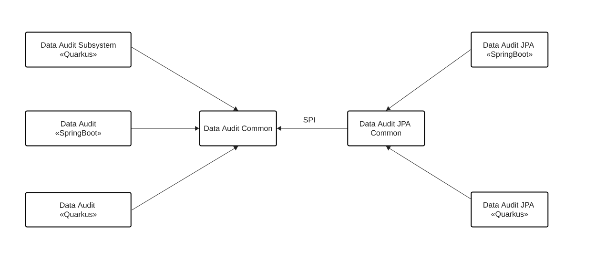

= Components of a process service
include::../partials/attributes.adoc[]

This section provides more detail on the deployment architecture to simplify event management and ensure stable and robust stateful applications.
The standard Event-Driven {PRODUCT} setup is better adapted to Serverless execution.

The new Compact Architecture consists of applications built using a new set of {PRODUCT} add-ons, that collocate add-on services (Jobs, Data audit, Data index) in the runtime.
This architecture simplifies the application configuration and minimizes the communication between components.

== The Jobs subsystem
The Jobs service takes care of scheduling jobs, in particular timers such as those from boundary events, SLA, or throw events relevant to timers.
It is also used for human tasks notifications.

By collocating the Job Scheduler within the {PRODUCT_SHORT} Runtime, the Job service add-on enables direct communication between both services inside a {PRODUCT_SHORT} App.
It uses the Data Source as the app.

The Jobs subsystem only supports Quarkus runtimes and PostgreSQL storage.

=== How it works

.Graphical view of the Job service flow
image::../images/job_service.png[]

When a client invokes the job service, the client component sends a message through the transport tier containing the information required to call back the sink once the job times out.
Once the request reaches the job service it creates the job internally, and stores the data on job status in the storage.
When the job times out, the component calls the sink (either in-vm or via http request) to signal to the client.

==== Definitions
transport:: the medium used to transfer a message between client component and job service. The transport can be http, kafka or in-vm.
sink:: is the client endpoint callback.
storage:: is the persistence tier of the jobs being current scheduled.
Job service:: it the main component containing the logic of scheduling a job and storing data.

=== Using the Job Service add-on

To use the Job service add-on in your project you must include the dependency related to the transport tier (in-vm):

[source,xml]
----
  <!-- Required for the Job service add-on transport tier definition -->
  <dependency>
    <groupId>org.kie</groupId>
    <artifactId>kogito-addons-quarkus-jobs-management</artifactId>
  </dependency>
  <dependency>
    <groupId>org.kie</groupId>
    <artifactId>kogito-addons-quarkus-jobs</artifactId>
  </dependency>
----

Following that you must include the storage to be used, (postgresql):

[source,xml]
----
<!-- Required for the Job service add-on storage definition -->
  <dependency>
      <groupId>org.kie</groupId>
      <artifactId>jobs-service-postgresql-common</artifactId>
  </dependency>
----

In this case for postgresql in-vm, your main available data source is automatically used. Here is an example of this configuration:
	
[source,properties]
----
kogito.persistence.type=jdbc
quarkus.datasource.db-kind=postgresql
quarkus.datasource.username=kogito-user
quarkus.datasource.password=kogito-pass
quarkus.datasource.jdbc.url=${QUARKUS_DATASOURCE_JDBC_URL:jdbc:postgresql://localhost:5432/kogito}
quarkus.datasource.reactive.url=${QUARKUS_DATASOURCE_REACTIVE_URL:postgresql://localhost:5432/kogito}
----

NOTE: Use managed dependencies or specify the version of the dependencies. 

NOTE: You can find ddl scripts for pgsql in `jobs-service-postgresql-common/src/main/resources/db/jobs-service`

== The Data Audit subsystem

The Data Audit subsystem enables the storage of events issued by the following process elements and persists them in the Data index subsystem:

* workflow engine
* user task
* job service

The system contains several modules and common modules to redistribute responsibilities. The main features of this system are:

* runs as colocated services with Quarkus 
* contains a module that enables you to implement your own subsystem
* contains graphql modules to query data
* provides extension points to develop new storage easily
* provides extension points to develop new queries extending graphql definitions

.Graphical view of the Data Audit subsystem

Data Audit Common:: Provides the common framework to create implementations.

Data Audit «Quarkus»:: Provides the wiring to use Data Audit with Quarkus as colocated service in a deployment.

Data Audit JPA Common:: Provides the common extension that doesn't depend on the runtime.

Data Audit JPA «Quarkus»:: Provides the wiring between the specific implementation and Quarkus System.

=== Querying

The way to retrieve information from the data audit is using GraphQL. This way we can abstract how the information is retrieved and allow different needs depending on the user.

The Path is `$\{HOST}/data-audit/q` for sending GraphQL queries.

==== Example 1

Execute a registered query, e.g. `GetAllProcessInstancesState` with a definition of data fields that should be returned:

[source,console]
----
curl -H "Content-Type: application/json" -H "Accept: application/json" -s -X POST http://${HOST}/data-audit/q/ -d '
{
    "query": "{GetAllProcessInstancesState {eventId, processInstanceId, eventType, eventDate}}"
}'|jq
----

To retrieve the GraphQL schema definition including a list of all registered queries, run a GET command to the `$\{HOST}/data-audit/r` endpoint. This endpoint can also be used to register new queries.

==== Example 2

Register a new query with a complex data type:

[source,]
----
curl -H "Content-Type: application/json" -H "Accept: application/json" -s -X POST http://${HOST}/data-audit/r/ -d '
{
    "identifier" : "tests",
    "graphQLDefinition" : "type EventTest { jobId : String, processInstanceId: String} type Query { tests (pagination: Pagination) : [ EventTest ] } ",
    "query" : "SELECT o.job_id, o.process_instance_id FROM job_execution_log o"
}'
----

Once registered, the new query can be executed similar to the pre-registered ones using the `$\{HOST}/data-audit/q` endpoint:

[source,]
----
curl -H "Content-Type: application/json" -H "Accept: application/json" -s -X POST http://${HOST}/data-audit/q/ -d '
{
    "query": "{tests {jobId, processInstanceId}}"
}'|jq
----

=== Java Persistence API (JPA) implementation

The JPA implementation allows you to store the events to be stored in a database.
To use this you will need to set up the datasource.

=== Extension Points

Some extensions depend on the runtime and others do not.

`org.kogito.kie.app.audit.spi.DataAuditContextFactory`:: depends on the runtime and enables the creation of the context needed by a particular implementation.

The following extension points do not depend on the runtime:

`org.kie.kogito.app.audit.spi.DataAuditStore`:: stores the data in particular way.

`org.kie.kogito.app.audit.spi.GraphQLSchemaQuery<T>`:: enables execution of a GraphQL query.

`org.kie.kogito.app.audit.spi.GraphQLSchemaQueryProvider`:: enables the subsystem to identify additional queries provided by the end user.

=== Using the Data audit add-on

You need to add two different dependencies to your project  for a collocated service.

[source,xml]
----
<dependency>
	  <groupId>org.kie</groupId>
	  <artifactId>kie-addons-<runtime>-data-audit</artifactId>
	  <version>${version}</version>
</dependency>
<dependency>
	  <groupId>org.kie</groupId>
	  <artifactId>kie-addons-<runtime>-data-audit-jpa</artifactId>
	  <version>${version}</version>
</dependency>
----

The first dependency is related how to you want to deploy it. In this case it is deployed as a collocated/embedded service.
The second dependency specifies the implementation you want to use.

Each implementation might require additional dependencies. In this case a driver may be required to use a Java Persistence API (JPA) implementation.

[source,xml]
----
<dependency>
	  <groupId>io.quarkus</groupId>
	  <artifactId>quarkus-jdbc-h2</artifactId>
</dependency>
----

No additional configuration is required besides the default datasource use by the application already.

== The Data Index subsystem
The Data Index subsystem is used to store a snapshot of the latest state of the process instance. 

.Graphical view of the Data Index subsystem
image::../images/data-index.png[]

The concepts to understand the above picture are:

Transport:: the medium used to transfer events between the runtime and the data index service. The transport is in-vm.

Storage:: the persistence tier of the data index component.

Data index:: the main component responsible for creating/updating the data index, and for providing query capabilities.

=== Querying

Data index support queries through graphQL (basic.schema.graphqls). For using the endpoint you just need to explore in your deployment the URI:

[source,]
----
http://localhost:8080/<root path>/graphql-ui/
----

to start working with the queries defined by the schema aforementioned.

=== Using the Data Index add-on

Use the Data Index add-on to enable Quarkus to use in-vm transport tier. The same dependency is used to specify the storage of the Data index and the transport tier simultaneously.

[source,xml]
----
<dependency>
  <groupId>org.kie</groupId>
  <artifactId>kogito-addons-quarkus-data-index-persistence-postgresql</artifactId>
</dependency>
----

