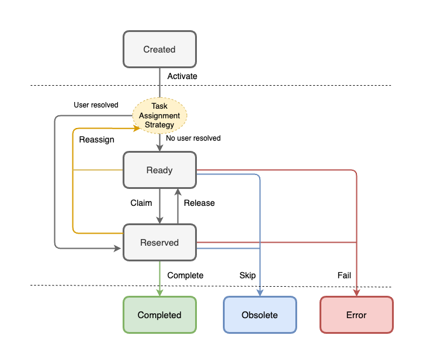

= Overview of stateful Workflows with Compact Architecture

include::../partials/attributes.adoc[]
include::../styles/images.adoc[]

You can use BAMOE to develop stateful workflow services using Business Process Model and Notation (BPMN) models. BPMN process models are graphical representations of the steps required to achieve a business goal. You can design your BPMN processes with {CANVAS} or {DEV_TOOLS}. Alternatively you can import existing BPMN processes into your Business Automation projects for deployment and execution. 

Stateful Workflow capabilities enable you to use elements such as process variables, events, timers, User Tasks and asynchronous Tasks (Service Tasks, Business Rule Tasks, and Script Tasks) to go further with BPMN workflows that you implement.  

The Compact Architecture is the reference architecture for stateful workflow. In this architecture certain services can be colocated directly in your {PRODUCT_SHORT} application. This simplifies the application configuration and minimizes the communication between components which ensures that {PRODUCT_SHORT} applications are stable and robust in a Business Process environment. 

== Components of Compact Architecture
The following table details the different components in Compact Architecture, indicating whether they are mandatory or not for stateful workflows.

[%header,cols="4"]
|===
^|Subsystem 
^|Type 
^|Stateful (Compact Architecture) 
^|Stateless (STP) 
|Data-Index | Add-on | Optional | N/A
|Data-Audit | Add-on | Optional | N/A
|Jobs Service | Add-on | Mandatory | N/A
|User Tasks | Add-on | Mandatory | N/A
|Workflow Engine | System | Mandatory | Mandatory 
|Runtime | System | Mandatory | N/A
|Storage | System | Mandatory | N/A
|===

The following figure shows how they relate to each other in a deployment architecture. 

.The different components of Compact Architecture
image::wf-compact-arch.png[]

=== System
Runtime:: This is the foundational framework providing basic services required for running a complex application: transactions, rest infrastructure (JAX-RS), JDBC connection pool, thread pools, escalability, security, DI (dependency injection) etc.

Workflow engine:: The kogito API + jBPM workflow engine provides the workflow execution environment using kogito APIs and implementations.

Process container:: This is the BPMN file compiled and wired in to the Workflow engine.

=== Add-ons
User Tasks:: is a subsystem that allows User Tasks to be executed. It provides a lifecycle internally. This should not be confused with a user task node in the workflow. The user task node uses this subsystem to implement user tasks.

Data-Index:: allows the last snapshot of the process state to be queried. The Workflow engine sends diff events and Data-Index computes the last state by merging current data with the diff event data.

Data-Audit:: allows the inspection of what happened during workflow execution. It should be able to replay the process. The system stores all diff event data comming from events.

Jobs Service:: allows the execution of timed events. In the case of Workflows with BPMN it is required for timers, deadlines and notifications. 

=== Required deployments
Storage:: This is another deployment where we are going to store the process state, Data-Index, Data-Audit, Jobs Service, and User Tasks data. There can only be one storage that is shared among components and cannot be divided.
.

== The Jobs Service subsystem
Jobs Service takes care of scheduling jobs, in particular timers such as those from boundary events, SLA, or throw events relevant to timers.
It is also used for User Tasks notifications.

By collocating the Jobs Service within the {PRODUCT_SHORT} Runtime, the Jobs Service add-on enables direct communication between both services inside a {PRODUCT_SHORT} App.
It uses the Data Source as the app.

The Jobs Service subsystem only supports Quarkus runtimes and storage can be PostgreSQL or Microsoft SQL Server.

=== How it works

.Graphical view of the Jobs Service flow
image::job_service.png[]

When a client invokes the Jobs Service, the client component sends a message through the transport tier containing the information required to call back the sink once the job times out.
Once the request reaches the Jobs Service it creates the job internally, and stores the data on job status in the storage.
When the job times out, the component calls the sink (either in-vm or via http request) to signal to the client.

==== Definitions
transport:: the medium used to transfer a message between client component and Jobs Service. The transport can be http, kafka or in-vm.
sink:: is the client endpoint callback.
storage:: is the persistence tier of the jobs being current scheduled.
Jobs Service:: it the main component containing the logic of scheduling a job and storing data.

=== Using the Jobs Service add-on

To use the Jobs Service add-on in your project you must include the dependency related to the transport tier (in-vm):

[source,xml]
----
<!-- Required for the Jobs Service add-on transport tier definition -->
<dependency>
  <groupId>org.kie</groupId>
  <artifactId>kogito-addons-quarkus-jobs-management</artifactId>
</dependency>

<dependency>
  <groupId>org.kie</groupId>
  <artifactId>kogito-addons-quarkus-jobs</artifactId>
</dependency>
----

Following that you must include the storage to be used, PostgreSQL:

[source,xml]
----
<!-- Required for the Jobs Service add-on storage definition -->
<dependency>
  <groupId>org.kie</groupId>
  <artifactId>jobs-service-storage-jpa</artifactId>
</dependency>
----

In this case for postgresql in-vm, your main available data source is automatically used. Here is an example of this configuration:
	
[source,properties]
----
kogito.persistence.type=jdbc
quarkus.datasource.db-kind=postgresql
quarkus.datasource.username=kogito-user
quarkus.datasource.password=kogito-pass
quarkus.datasource.jdbc.url=${QUARKUS_DATASOURCE_JDBC_URL:jdbc:postgresql://localhost:5432/kogito}
----

NOTE: Use managed dependencies or specify the version of the dependencies. 

[#data-audit]
== The Data-Audit subsystem

The Data-Audit subsystem enables the storage of events issued by the following process elements and persists them in the Data-Index subsystem:

* Workflow engine
* User Tasks
* Jobs Service

The system contains several modules and common modules to redistribute responsibilities. The main features of this system are:

* runs as colocated services with Quarkus 
* contains a module that enables you to implement your own subsystem
* contains graphql modules to query data
* provides extension points to develop new storage easily
* provides extension points to develop new queries extending graphql definitions

.Graphical view of the Data-Audit subsystem
image::data-audit-design.png[]

Data-Audit Common:: Provides the common framework to create implementations.

Data-Audit «Quarkus»:: Provides the wiring to use Data-Audit with Quarkus as colocated service in a deployment.

Data-Audit JPA Common:: Provides the common extension that doesn't depend on the runtime.

Data-Audit JPA «Quarkus»:: Provides the wiring between the specific implementation and Quarkus System.

=== Querying

The way to retrieve information from the Data-Audit is using GraphQL. This way we can abstract how the information is retrieved and allow different needs depending on the user.

The Path is `$\{HOST}/data-audit/q` for sending GraphQL queries.

==== Example 1

Execute a registered query, e.g. `GetAllProcessInstancesState` with a definition of data fields that should be returned:

[source,console]
----
curl -H "Content-Type: application/json" -H "Accept: application/json" -s -X POST http://${HOST}/data-audit/q/ -d '
{
    "query": "{GetAllProcessInstancesState {eventId, processInstanceId, eventType, eventDate}}"
}'|jq
----

To retrieve the GraphQL schema definition including a list of all registered queries, run a GET command to the `$\{HOST}/data-audit/r` endpoint. This endpoint can also be used to register new queries.

==== Example 2

Register a new query with a complex data type:

[source,]
----
curl -H "Content-Type: application/json" -H "Accept: application/json" -s -X POST http://${HOST}/data-audit/r/ -d '
{
    "identifier" : "tests",
    "graphQLDefinition" : "type EventTest { jobId : String, processInstanceId: String} type Query { tests (pagination: Pagination) : [ EventTest ] } ",
    "query" : "SELECT o.job_id, o.process_instance_id FROM job_execution_log o"
}'
----

Once registered, the new query can be executed similar to the pre-registered ones using the `$\{HOST}/data-audit/q` endpoint:

[source,]
----
curl -H "Content-Type: application/json" -H "Accept: application/json" -s -X POST http://${HOST}/data-audit/q/ -d '
{
    "query": "{tests {jobId, processInstanceId}}"
}'|jq
----

=== Java Persistence API (JPA) implementation

The JPA implementation allows you to store the events to be persisted in a database.
To use this you will need to set up the datasource.

=== Extension Points

Some extensions depend on the runtime and others do not.

`org.kogito.kie.app.audit.spi.DataAuditContextFactory`:: depends on the runtime and enables the creation of the context needed by a particular implementation.

The following extension points do not depend on the runtime:

`org.kie.kogito.app.audit.spi.DataAuditStore`:: stores the data in particular way.

`org.kie.kogito.app.audit.spi.GraphQLSchemaQuery<T>`:: enables execution of a GraphQL query.

`org.kie.kogito.app.audit.spi.GraphQLSchemaQueryProvider`:: enables the subsystem to identify additional queries provided by the end user.

=== Using the Data-Audit add-on

You need to add two different dependencies to your project  for a collocated service.

[source,xml]
----
<dependency>
  <groupId>org.kie</groupId>
  <artifactId>kogito-addons-quarkus-data-audit</artifactId>
</dependency>

<dependency>
  <groupId>org.kie</groupId>
  <artifactId>kogito-addons-quarkus-data-audit-jpa</artifactId>
</dependency>
----

The first dependency is related how to you want to deploy it. In this case it is deployed as a collocated/embedded service.
The second dependency specifies the implementation you want to use.

Each implementation might require additional dependencies. In this case a driver may be required to use a Java Persistence API (JPA) implementation.

[source,xml]
----
<dependency>
  <groupId>io.quarkus</groupId>
  <artifactId>quarkus-jdbc-h2</artifactId>
</dependency>
----

No additional configuration is required besides the default datasource use by the application already.

== The Data-Index subsystem
The Data-Index subsystem is used to store a snapshot of the latest state of the process instance. 

.Graphical view of the Data-Index subsystem
image::data-index.png[]

The concepts to understand the above picture are:

Transport:: the medium used to transfer events between the runtime and the Data-Index service. The transport is in-vm.

Storage:: the persistence tier of the Data-Index component.

Data-Index:: the main component responsible for creating/updating the Data-Index, and for providing query capabilities.

=== Querying

Data-Index support queries through graphQL (basic.schema.graphqls). For using the endpoint you just need to explore in your deployment the URI:

[source,]
----
http://localhost:8080/<root-path>/graphql-ui/
----

to start working with the queries defined by the schema aforementioned.

=== Using the Data-Index add-on

Use the Data-Index add-on to enable Quarkus to use in-vm transport tier. The same dependency is used to specify the storage of the Data-Index and the transport tier simultaneously.

[source,xml]
----
<dependency>
  <groupId>org.kie</groupId>
  <artifactId>kogito-addons-quarkus-data-index-jpa</artifactId>
</dependency>
----

[#user-tasks]
== The User Tasks Subsystem

In {PRODUCT_SHORT} `User Task` is a special type of activity that cannot be automatically executed by the workflow engine, requiring the
manual intervention of a user. When a process instance reaches a `User Task` node, a new user task is created and the process
instance is stopped waiting for the completion of the user task. Once the user task completes, the process can continue its execution normally.

The User Task subsystem is responsible for the execution of User Tasks initiated by the workflow engine, enabling users to move
tasks through the different phases of their User Task Lifecycle until they reach a `Completion state.

The User Task Subsystem provides the following features:

* Runs as a collocated service in the process engine with no extra configuration in the required in the application.
* Generic set of REST Apis to interact with it, enabling users to transition tasks between the different lifecycle phases,
modify task data (inputs and outputs), add comments and attachments on tasks.
* Customizable *Task Assignment Strategy* to automatically assign tasks to users during the task `Activate` phase (also known as `UserGroupCallback` in previous {PRODUCT_SHORT} versions)
* Customizable User Task Lifecycle

=== The User Task LifeCycle

The User Task Subsystem defines a Default Lifecycle that enables users to transition a task through different phases that will change
the task state until it reaches a `Completion` state, allowing the associated process instance to continue executing.

.Default User Task Lifecycle

With the Default Lifecycle, when a User Task is initiated in the User Task Subsystem it starts in a *Created* state. At that moment,
 it automatically passes through the `Activate` phase that will set the task in *Ready* state, making the task available to the users
that are allowed to work with it.
The task will then remain in *Ready* state until a user claims it, which will make the task pass through the `Claim` phase
making the move into a *Reserved* state and the user will become the owner of the task.

With the task *Reserved*, the owner will be able to complete the task (`Complete` phase) that will finally move the task to a *Completed* that will
successfully finalize the task allowing the process instance to continue.

Tasks in *Ready* or *Reserved* state, are can also be reassigned (`Reassign` phase) that will unassign the task owner and will try to assign it to a different actor.

Also, Tasks in *Ready* or *Reserved* state, can be finalized with the `Fail` phase, that will make the task terminate in a *Failed* state indicating an abnormal completion or through `Skip` phase that will
finalize the task in a *Obsolete* state  indicating that the task was not executed.

NOTE: During the `Activate` and `Reassign` phases, if the task has a single potential owner the task will be directly moved into a *Reserved* and assigned that user. This mechanism can be customized by defining a new *Task Assignment Strategy*.

=== User Task JPA persistence

The User Task subsystem by default uses an in-memory storage, but it can be configured to persist its data in database
using the default application Data Source using the `jbpm-addons-quarkus-usertask-storage-jpa` add-on.
To enable this functionality, the following dependency needs to be added to the application `pom.xml` file:

[source,xml]
----
<dependency> 
  <groupId>org.jbpm</groupId> 
  <artifactId>jbpm-addons-quarkus-usertask-storage-jpa</artifactId>
</dependency>
----