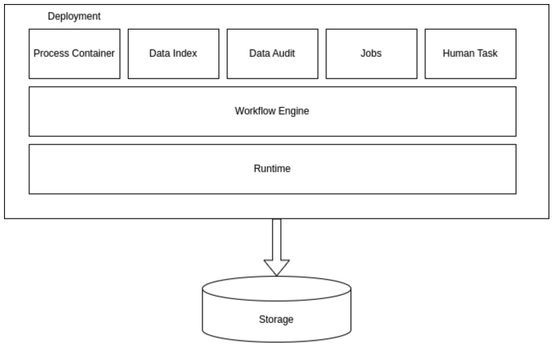

= Overview stateful processes

include::../partials/attributes.adoc[]

As a developer of business processes, you can use BAMOE to develop process services using Business Process Model and Notation (BPMN) 2.0 models. BPMN process models are graphical representations of the steps required to achieve a business goal. You can design your BPMN processes with Canvas or the Kogito BPMN modeler in VS Code. Alternatively you can import existing BPMN processes into your BAMOE projects for deployment and execution. 

This technology preview enables you to go further in the BPMN workflows that you implement enabling you to use new elements such as process variables, events, timers,  human tasks and asynchronous tasks (service, decision, script). 

This section also introduces the key concepts of the new Compact Architecture where certain services can be colocated directly in the Runtime. This architecture simplifies the application configuration and minimizes the communication between components which ensures that {PRODUCT_SHORT} applications are stable and robust in a Business Process environment. 

== Compact architecture 
Compact architecture is a way to enable a process to run everything in an integrated way within the same
deployment. In this architecture the communication with required or optional subsystems is via internal VM
communication. Here are some basic definitions:

deployment:: is considered to be a consistent functional program that provides a set of defined functionalities that enable workflow execution.

stateful process:: is one that is able to persist the process instance state into a database or other type of storage. 

stateless process or straight-through process (STP):: is a process whose instance state cannot be stored in database. Stateless processes are a subset of stateful process.

.The different components of Compact architecture

The following table shows the mandatory components in the subsystem of the compact architecture to implement a stateful workflow.

|=== 
|Subsystem | Type | Stateful process (compact) | Stateless (STP) 
|Workflow engine | System | mandatory | mandatory 
|Storage/persistence | System | mandatory | N/A
|Data index | Addon | optional | N/A
|Data audit | Addon | optional | N/A
|Jobs | Addon | mandatory | N/A
|Human task | Addon | mandatory | N/A
|===

== Component description

=== System
Runtime:: This is the infrastructure providing basic services required for running a complex application: transactions, rest infraestructure (JAX-RS), jdbc pool, thread pools, escalability, security, DI (dependency injection). The runtime relies on Quarkus.

Workflow Engine:: The kogito API + jBPM workflow engine provides the workflow execution environment using kogito APIs and implementations.

Process Container:: This is the BPMN file compiled and wired in to the workflow engine.

=== Addons
Jobs:: allows the execution of timed events. In the case of BPMN and workflows it is required for timers, deadlines, and notifications. 

Data Audit:: allows the inspection of what happened during workflow execution. It should be able to replay the process. The system stores all diff event data comming from events.

Data Index:: allows the last snapshot of the process state to be queried. The workflow engine sends diff events and data index computes the last state by merging current data with the diff event data.

Human Task:: subsystem that allows human tasks to be executed. It provides a lifecycle internally. This should not be confused with a user task node in the workflow. The user task node uses this subsystem to implement user tasks.

=== Required deployments
Storage:: This is another deployment. In our case would be PostgreSQL database where we are going to store the process state, jobs, data index, data audit and human task data. There can only be one storage that is shared among components and cannot be divided.

