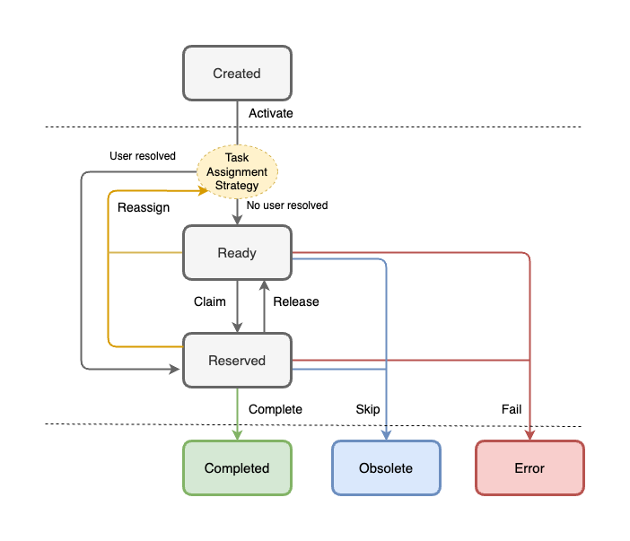

= Overview of stateful Workflows with Compact Architecture

include::../partials/attributes.adoc[]
include::../styles/images.adoc[]

You can use BAMOE to develop stateful Workflow services using Business Process Model and Notation (BPMN) models. BPMN process models are graphical representations of the steps required to achieve a business goal. You can design your BPMN processes with {CANVAS} or {DEV_TOOLS}. Alternatively you can import existing BPMN processes into your Business Automation projects for deployment and execution. 

Stateful Workflow capabilities enable you to use elements such as process variables, events, timers, User Tasks and asynchronous Tasks (Service Tasks, Business Rule Tasks, and Script Tasks) to go further with BPMN workflows that you implement.  

The Compact Architecture is the reference architecture for _Business Services_ containing stateful Workflows on BAMOE. In this architecture certain subsystems are colocated directly in your _Business Service_, simplifying configuration and minimizing communication between components, which ensures that _Business Services_ are stable and robust.

== Components of Compact Architecture
The following table details the different components in Compact Architecture, indicating whether they are mandatory or not for stateful Workflows.

[%header,cols="4"]
|===
^|Component 
^|Type 
^|Stateful (Compact Architecture) 
^|Stateless (STP) 
|Workflow models | BPMN files | Mandatory | Mandatory 
|Workflow Engine | System | Mandatory | Mandatory 
|Runtime | System | Mandatory | N/A
|Data-Index | Subsystem (add-on) | Optional | N/A
|Data-Audit | Subsystem (add-on) | Optional | N/A
|Jobs Service | Subsystem (add-on) | Mandatory | N/A
|User Tasks | Subsystem (add-on) | Mandatory | N/A
|Storage | External system | Mandatory | N/A
|===

The following figure shows how they relate to each other in a Business Service. 

.The different components of Compact Architecture
image::wf-compact-arch.png[]

Workflow models:: BPMN files containing a sequence flow. Workflow models are compiled and wired in to the Workflow Engine when building _Business Services_ into executables.

Workflow Engine:: The jBPM-powered engine for executing Workflows and which can delegate certain capabilities to other subsystems, like User Tasks or Jobs.

Runtime:: The Kogito-powered foundational framework providing basic services required for running Enterprise-grade _Business Services_: transactions, REST endpoints (JAX-RS), JDBC connection pools, thread pools, escalability, authentication and authorization, DI (dependency injection) etc. Quarkus is the only supported Runtime at the moment.

Data-Index:: See below.

Data-Audit:: See below.

Jobs Service:: See below.

User Tasks:: See below.

Storage:: An external system where _Business Services_ containing stateful Workflows store Process Instances, Data-Index, Data-Audit, Jobs Service, and User Tasks data. All subsystems store data in the same storage, which is usually a relation database such as PostgreSQL.

[#data-index]
== The Data-Index subsystem
The Data-Index subsystem is used to store a snapshot of the latest state of the process instance and allows it to be queried. The Workflow Engine sends diff events and Data-Index computes the last state by merging current data with the diff event data.

.Graphical view of the Data-Index subsystem
image::data-index.png[]

Data-Index support queries through GraphQL (`basic.schema.graphqls`). To use the endpoint, access the `/graphql-ui/` path, e.g., http://localhost:8080/graphql-ui/ for a _Business Service_ running locally.

See the associated xref:data-index-graphql-api.html[Data-Index GraphQL API]

[#data-audit]
== The Data-Audit subsystem

The Data Audit subsystem enables you to inspect what happened during process execution. The system stores all diff event data coming from events, and can replay the process. The Data-Audit subsystem listens to events issued by the following components and persists them in the configured storage:

* Workflow Engine
* User Tasks
* Jobs Service

See the associated xref:data-audit-api.html[Data-Audit API]

[#jobs-service]
== The Jobs Service subsystem
Jobs Service takes care of scheduling jobs, in particular timers such as those from boundary events, SLA, or throw events relevant to timers. It is also used for User Tasks notifications.

.Graphical view of the Jobs Service subsystem
image::jobs-service-overview.png[]

[#user-tasks]
== The User Tasks subsystem

In Workflows built with BPMN, `User Task` is a special type of activity that cannot be automatically executed by the workflow engine, requiring the
manual intervention of a user. When a process instance reaches a `User Task` node, a new User Task is created and the process
instance is stopped waiting for the completion of the User Task. Once the User Task completes, the process can continue its execution normally.

The User Tasks subsystem is responsible for the execution of User Tasks initiated by the workflow engine, enabling users to move
tasks through the different phases of their life cycle until they reach a **Completed** state.

The User Tasks subsystem provides the following features:

* Runs as a collocated service in the Workflow Engine with no extra configuration required in the application.
* Generic set of REST API endpoints to interact with it, enabling users to transition User Tasks between the different lifecycle phases,
modify User Task data (inputs and outputs), add comments and attachments to User Tasks.
* Customizable *User Task Assignment Strategy* to automatically assign User Tasks to users during the task `Activate` phase.
* Customizable User Task life cycle

See the associated xref:user-tasks.html[User Tasks API]

=== The User Task life cycle

The User Tasks subsystem defines a Default life cycle that enables users to transition a task through different phases that will change
the task state until it reaches a `Completion` state, allowing the associated process instance to continue executing.

.Default User Task life cycle

With the Default life cycle, when a User Task is initiated in the User Task Subsystem it starts in a *Created* state. At that moment, it automatically passes through the `Activate` phase that will set the task in *Ready* state, making the task available to the users that are allowed to work with it.

The task will then remain in *Ready* state until a user claims it, which will make the task pass through the `Claim` phase making the move into a *Reserved* state and the user will become the owner of the task.

With the task *Reserved*, the owner will be able to complete the task (`Complete` phase) that will finally move the task to a *Completed* that will successfully finalize the task allowing the process instance to continue.

User Tasks in *Ready* or *Reserved* state, are can also be reassigned (`Reassign` phase) that will unassign the task owner and will try to assign it to a different actor.

Also, Users Tasks in *Ready* or *Reserved* state, can be finalized with the `Fail` phase, that will make the task terminate in a *Error* state indicating an abnormal completion or through `Skip` phase that will finalize the task in a *Obsolete* state  indicating that the task was not executed.

NOTE: During the `Activate` and `Reassign` phases, if the task has a single potential owner the task will be directly moved into a *Reserved* and assigned that user. This mechanism can be customized by defining a new *Task Assignment Strategy*.

== Getting started

To start developing stateful Workflows with Compact Architecture, go to xref:../workflow/authoring-workflows.adoc[Authoring Workflows with BPMN].