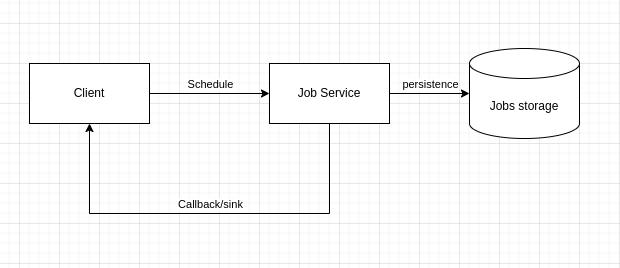
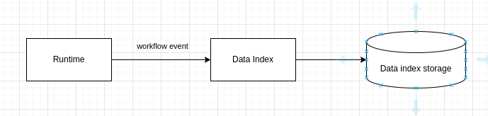

= Architecture overview of stateful Workflows

include::../partials/attributes.adoc[]

As a developer of business processes, you can use BAMOE to develop process services using Business Process Model and Notation (BPMN) 2.0 models. BPMN process models are graphical representations of the steps required to achieve a business goal. You can design your BPMN processes with {CANVAS} or {DEV_TOOLS}. Alternatively you can import existing BPMN processes into your Business Automation projects for deployment and execution. 

Stateful Workflows capabilities enables you to go further with BPMN workflows that you implement by allowing you to use elements such as process variables, events, timers, User Tasks and asynchronous Tasks (Service Tasks, Business Rule Tasks, and Script Tasks). 

This section also introduces the key concepts of the new Compact Architecture where certain services can be colocated directly in the your Business Automation application. This architecture simplifies the application configuration and minimizes the communication between components which ensures that {PRODUCT_SHORT} applications are stable and robust in a Business Process environment. 

== Compact Architecture 
Compact Architecture is a way to enable a process to run everything in an integrated way within the same deployment. In this architecture the communication with required and/or optional subsystems is done via internal VM communication. Here are some basic definitions:

Deployment:: is considered to be a consistent functional program that provides a set of defined functionalities that enable workflow execution.

Stateful Workflow:: is a process that is able to persist its instance state into a database or other type of storage. It may include user tasks, timers, be long-running, have data tracking and auditing.

Stateless Workflow or Straight-Through Process (STP):: is a Workflow whose instance state is not stored in database. A stateless Workflow is executed in one transaction, does not have data persistence, timers or User Tasks. Stateless Workflows are a subset of stateful Workflows.

.The different components of Compact Architecture
image::../images/wf-compact-arch.png[]

The following table shows the mandatory components in the subsystem of the Compact Architecture to implement a stateful Workflow.

[%header,cols="4"]
|===
^|Subsystem 
^|Type 
^|Stateful (Compact Architecture) 
^|Stateless (STP) 

|Workflow Engine | System | Mandatory | Mandatory 
|Data-Index | Add-on | Optional | N/A
|Data-Audit | Add-on | Optional | N/A
|Jobs Service | Add-on | Mandatory | N/A
|User Tasks | Add-on | Mandatory | N/A
|Runtime | Add-on | Mandatory | N/A
|Storage | System | Mandatory | N/A
|===

== Component description

=== System
Runtime:: This is the foundational framework providing basic services required for running a complex application: transactions, rest infraestructure (JAX-RS), JDBC connection pool, thread pools, escalability, security, DI (dependency injection) etc.

Workflow engine:: The kogito API + jBPM workflow engine provides the workflow execution environment using kogito APIs and implementations.

Process container:: This is the BPMN file compiled and wired in to the Workflow engine.

=== Add-ons
Data-Index:: allows the last snapshot of the process state to be queried. The Workflow engine sends diff events and Data-Index computes the last state by merging current data with the diff event data.

Data-Audit:: allows the inspection of what happened during workflow execution. It should be able to replay the process. The system stores all diff event data comming from events.

Jobs Service:: allows the execution of timed events. In the case of Workflows with BPMN it is required for timers, deadlines, and notifications. 

User Tasks:: is a subsystem that allows User Tasks to be executed. It provides a lifecycle internally. This should not be confused with a user task node in the workflow. The user task node uses this subsystem to implement user tasks.

=== Required deployments
Storage:: This is another deployment. In our case would be PostgreSQL database where we are going to store the process state, Data-Index, Data-Audit, Jobs Service, and User Tasks data. There can only be one storage that is shared among components and cannot be divided.

This section provides more detail on the different components of a stateful worfklow that uses the Compact Architecture.
The standard Event-Driven {PRODUCT} setup is better adapted to Serverless execution.

Compact Architecture consists of applications built using a new set of {PRODUCT} add-ons, that collocate add-on services (Data-Index, Data Audit, Jobs Service, and User Tasks) in the runtime.

This architecture simplifies the application configuration and minimizes the communication between components.

== The Jobs Service subsystem
Jobs Service takes care of scheduling jobs, in particular timers such as those from boundary events, SLA, or throw events relevant to timers.
It is also used for User Tasks notifications.

By collocating the Jobs Service within the {PRODUCT_SHORT} Runtime, the Jobs Service add-on enables direct communication between both services inside a {PRODUCT_SHORT} App.
It uses the Data Source as the app.

The Jobs Service subsystem only supports Quarkus runtimes and storage can be PostgreSQL or Microsoft SQL Server.

=== How it works

.Graphical view of the Jobs Service flow

When a client invokes the Jobs Service, the client component sends a message through the transport tier containing the information required to call back the sink once the job times out.
Once the request reaches the Jobs Service it creates the job internally, and stores the data on job status in the storage.
When the job times out, the component calls the sink (either in-vm or via http request) to signal to the client.

==== Definitions
transport:: the medium used to transfer a message between client component and Jobs Service. The transport can be http, kafka or in-vm.
sink:: is the client endpoint callback.
storage:: is the persistence tier of the jobs being current scheduled.
Jobs Service:: it the main component containing the logic of scheduling a job and storing data.

=== Using the Jobs Service add-on

To use the Jobs Service add-on in your project you must include the dependency related to the transport tier (in-vm):

[source,xml]
----
  <!-- Required for the Jobs Service add-on transport tier definition -->
  <dependency>
    <groupId>org.kie</groupId>
    <artifactId>kogito-addons-quarkus-jobs-management</artifactId>
  </dependency>
  <dependency>
    <groupId>org.kie</groupId>
    <artifactId>kogito-addons-quarkus-jobs</artifactId>
  </dependency>
----

Following that you must include the storage to be used, PostgreSQL:

[source,xml]
----
<!-- Required for the Jobs Service add-on storage definition -->
  <dependency>
      <groupId>org.kie</groupId>
      <artifactId>jobs-service-storage-jpa</artifactId>
  </dependency>
----

In this case for postgresql in-vm, your main available data source is automatically used. Here is an example of this configuration:
	
[source,properties]
----
kogito.persistence.type=jdbc
quarkus.datasource.db-kind=postgresql
quarkus.datasource.username=kogito-user
quarkus.datasource.password=kogito-pass
quarkus.datasource.jdbc.url=${QUARKUS_DATASOURCE_JDBC_URL:jdbc:postgresql://localhost:5432/kogito}
----

NOTE: Use managed dependencies or specify the version of the dependencies. 

== The Data Audit subsystem

The Data Audit subsystem enables the storage of events issued by the following process elements and persists them in the Data-Index subsystem:

* Workflow engine
* User Tasks
* Jobs Service

The system contains several modules and common modules to redistribute responsibilities. The main features of this system are:

* runs as colocated services with Quarkus 
* contains a module that enables you to implement your own subsystem
* contains graphql modules to query data
* provides extension points to develop new storage easily
* provides extension points to develop new queries extending graphql definitions

.Graphical view of the Data Audit subsystem
image::../images/data-audit-design.png[]

Data Audit Common:: Provides the common framework to create implementations.

Data Audit «Quarkus»:: Provides the wiring to use Data Audit with Quarkus as colocated service in a deployment.

Data Audit JPA Common:: Provides the common extension that doesn't depend on the runtime.

Data Audit JPA «Quarkus»:: Provides the wiring between the specific implementation and Quarkus System.

=== Querying

The way to retrieve information from the Data Audit is using GraphQL. This way we can abstract how the information is retrieved and allow different needs depending on the user.

The Path is `$\{HOST}/data-audit/q` for sending GraphQL queries.

==== Example 1

Execute a registered query, e.g. `GetAllProcessInstancesState` with a definition of data fields that should be returned:

[source,console]
----
curl -H "Content-Type: application/json" -H "Accept: application/json" -s -X POST http://${HOST}/data-audit/q/ -d '
{
    "query": "{GetAllProcessInstancesState {eventId, processInstanceId, eventType, eventDate}}"
}'|jq
----

To retrieve the GraphQL schema definition including a list of all registered queries, run a GET command to the `$\{HOST}/data-audit/r` endpoint. This endpoint can also be used to register new queries.

==== Example 2

Register a new query with a complex data type:

[source,]
----
curl -H "Content-Type: application/json" -H "Accept: application/json" -s -X POST http://${HOST}/data-audit/r/ -d '
{
    "identifier" : "tests",
    "graphQLDefinition" : "type EventTest { jobId : String, processInstanceId: String} type Query { tests (pagination: Pagination) : [ EventTest ] } ",
    "query" : "SELECT o.job_id, o.process_instance_id FROM job_execution_log o"
}'
----

Once registered, the new query can be executed similar to the pre-registered ones using the `$\{HOST}/data-audit/q` endpoint:

[source,]
----
curl -H "Content-Type: application/json" -H "Accept: application/json" -s -X POST http://${HOST}/data-audit/q/ -d '
{
    "query": "{tests {jobId, processInstanceId}}"
}'|jq
----

=== Java Persistence API (JPA) implementation

The JPA implementation allows you to store the events to be persisted in a database.
To use this you will need to set up the datasource.

=== Extension Points

Some extensions depend on the runtime and others do not.

`org.kogito.kie.app.audit.spi.DataAuditContextFactory`:: depends on the runtime and enables the creation of the context needed by a particular implementation.

The following extension points do not depend on the runtime:

`org.kie.kogito.app.audit.spi.DataAuditStore`:: stores the data in particular way.

`org.kie.kogito.app.audit.spi.GraphQLSchemaQuery<T>`:: enables execution of a GraphQL query.

`org.kie.kogito.app.audit.spi.GraphQLSchemaQueryProvider`:: enables the subsystem to identify additional queries provided by the end user.

=== Using the Data Audit add-on

You need to add two different dependencies to your project  for a collocated service.

[source,xml]
----
<dependency>
	  <groupId>org.kie</groupId>
	  <artifactId>kie-addons-quarkus-data-audit</artifactId>
	  <version>${version}</version>
</dependency>
<dependency>
	  <groupId>org.kie</groupId>
	  <artifactId>kie-addons-quarkus-data-audit-jpa</artifactId>
	  <version>${version}</version>
</dependency>
----

The first dependency is related how to you want to deploy it. In this case it is deployed as a collocated/embedded service.
The second dependency specifies the implementation you want to use.

Each implementation might require additional dependencies. In this case a driver may be required to use a Java Persistence API (JPA) implementation.

[source,xml]
----
<dependency>
	  <groupId>io.quarkus</groupId>
	  <artifactId>quarkus-jdbc-h2</artifactId>
</dependency>
----

No additional configuration is required besides the default datasource use by the application already.

== The Data-Index subsystem
The Data-Index subsystem is used to store a snapshot of the latest state of the process instance. 

.Graphical view of the Data-Index subsystem

The concepts to understand the above picture are:

Transport:: the medium used to transfer events between the runtime and the Data-Index service. The transport is in-vm.

Storage:: the persistence tier of the Data-Index component.

Data-Index:: the main component responsible for creating/updating the Data-Index, and for providing query capabilities.

=== Querying

Data-Index support queries through graphQL (basic.schema.graphqls). For using the endpoint you just need to explore in your deployment the URI:

[source,]
----
http://localhost:8080/<root path>/graphql-ui/
----

to start working with the queries defined by the schema aforementioned.

=== Using the Data-Index add-on

Use the Data-Index add-on to enable Quarkus to use in-vm transport tier. The same dependency is used to specify the storage of the Data-Index and the transport tier simultaneously.

[source,xml]
----
<dependency>
  <groupId>org.kie</groupId>
  <artifactId>kogito-addons-quarkus-data-index-jpa</artifactId>
</dependency>
----

== The User Tasks Subsystem
A User Task is a typical process or workflow task where a human performs the Task with the assistance of a software application and is scheduled through a task list manager.

=== User Task JPA persistence
The User Task sub-system can now be configured to persist its data in a database. To enable this functionality, the following dependency needs to be added to the application `pom.xml`` file:

[source,java]
----
<!-- User Task persistence --> 
<dependency> 
  <groupId>org.jbpm</groupId> 
  <artifactId>jbpm-addons-quarkus-usertask-storage-jpa</artifactId>
</dependency>
----

=== Configuring User Task assignment strategies

User Tasks can be assigned to a single User based on a defined logic, which is active by default. The algorithm will automatically assign ANY User Tasks in `ACTIVATE` status for the resulting person that is part of the “Potential Users” group associated to that User Task and the same person is NOT part of the “Excluded Users” group associated to the same User Taks. In other words, the algorithm performs a Set Difference between the Potential Users and the Excluded User of a given User Taks. If that difference results in a single user, the User Task is automatically assigned to that user and moved to “CLAIM” status. In all other cases, the User Tasks is not assigned and no changes are applied on it.

This default logic covers the basic use case. To implement your specific business logic to automatically assign User Tasks create a new Java Class that extends the `BasicUserTaskAssignmentStrategy` class. This class represents the Java class that holds the default logic previously described. The logic should be wrapped into the inherited computeAssigment method. The effect of this action is to replace the the default logic with your own custom logic. An example of a custom UserTaskAssignmentStrategy is shown below:

[source, java]
----
@Specializes
@ApplicationScoped
public class CustomUserTaskAssignmentStrategy extends BasicUserTaskAssignmentStrategy {

    @Override
    public Optional<String> computeAssignment(UserTaskInstance userTaskInstance, IdentityProvider identityProvider) {
        /*
         YOUR CUSTOM LOGIC TO AUTOMATICALLY ASSIGN THE THE USER TASK
         */
    }

}
----
