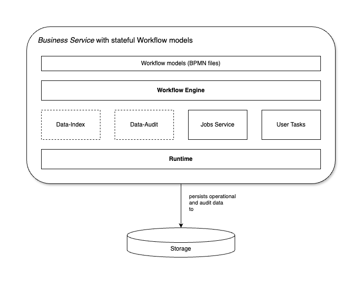

= Overview of stateful Workflows

include::../partials/attributes.adoc[]

As a developer of business processes, you can use BAMOE to develop process services using Business Process Model and Notation (BPMN) 2.0 models. BPMN process models are graphical representations of the steps required to achieve a business goal. You can design your BPMN processes with {CANVAS} or {DEV_TOOLS}. Alternatively you can import existing BPMN processes into your Business Automation projects for deployment and execution. 

Stateful Workflows capabilities enables you to go further with BPMN workflows that you implement by allowing you to use elements such as process variables, events, timers, User Tasks and asynchronous Tasks (Service Tasks, Business Rule Tasks, and Script Tasks). 

This section also introduces the key concepts of the new Compact Architecture where certain services can be colocated directly in the your Business Automation application. This architecture simplifies the application configuration and minimizes the communication between components which ensures that {PRODUCT_SHORT} applications are stable and robust in a Business Process environment. 

== Compact Architecture 
Compact Architecture is a way to enable a process to run everything in an integrated way within the same deployment. In this architecture the communication with required and/or optional subsystems is done via internal VM communication. Here are some basic definitions:

Deployment:: is considered to be a consistent functional program that provides a set of defined functionalities that enable workflow execution.

Stateful Workflow:: is a process that is able to persist its instance state into a database or other type of storage. It may include user tasks, timers, be long-running, have data tracking and auditing.

Stateless Workflow or Straight-Through Process (STP):: is a Workflow whose instance state is not stored in database. A stateless Workflow is executed in one transaction, does not have data persistence, timers or User Tasks. Stateless Workflows are a subset of stateful Workflows.

.The different components of Compact Architecture

The following table shows the mandatory components in the subsystem of the Compact Architecture to implement a stateful Workflow.

[%header,cols="4"]
|===
^|Subsystem 
^|Type 
^|Stateful (Compact Architecture) 
^|Stateless (STP) 

|Workflow Engine | System | Mandatory | Mandatory 
|Data-Index | Add-on | Optional | N/A
|Data Audit | Add-on | Optional | N/A
|Jobs Service | Add-on | Mandatory | N/A
|User Tasks | Add-on | Mandatory | N/A
|Runtime | Add-on | Mandatory | N/A
|Storage | System | Mandatory | N/A
|===

== Component description

=== System
Runtime:: This is the foundational framework providing basic services required for running a complex application: transactions, rest infraestructure (JAX-RS), JDBC connection pool, thread pools, escalability, security, DI (dependency injection) etc.

Workflow engine:: The kogito API + jBPM workflow engine provides the workflow execution environment using kogito APIs and implementations.

Process container:: This is the BPMN file compiled and wired in to the Workflow engine.

=== Add-ons
Data-Index:: allows the last snapshot of the process state to be queried. The Workflow engine sends diff events and Data-Index computes the last state by merging current data with the diff event data.

Data Audit:: allows the inspection of what happened during workflow execution. It should be able to replay the process. The system stores all diff event data comming from events.

Jobs Service:: allows the execution of timed events. In the case of Workflows with BPMN it is required for timers, deadlines, and notifications. 

User Tasks:: is a subsystem that allows human tasks to be executed. It provides a lifecycle internally. This should not be confused with a user task node in the workflow. The user task node uses this subsystem to implement user tasks.

=== Required deployments
Storage:: This is another deployment. In our case would be PostgreSQL database where we are going to store the process state, Jobs, Data-Index, Data Audit and User Tasks data. There can only be one storage that is shared among components and cannot be divided.

